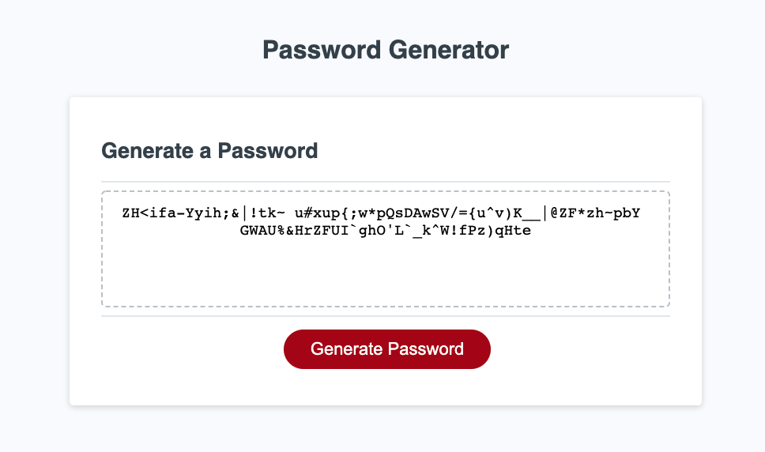

# password-generator

In this project, I have implemented the javascript code for a password generator. First it prompts the user for a password length which must be between 8 and 128 characters. No non-numbers will be accepted as user input, and only numbers between 8 and 128 will be accepted. Then the user in a series of prompts gets to choose what kind of characters they want to be included in the password. The choices are lowercase letters, uppercase letters, numbers, and special characters. The user must choose at least one of these options.

To generate the password, I create a charSet string which contains the set of characters to be used for the password that the user chose. Then I create an array of a length that the user chose for a password. For each node in that array, I randomly select a character from the charSet. Then I convert that array of characters to a string which is the user's generated password. 

Here is an example password that was generated. It has a length of 90 and contains lowercase letters, uppercase letters, and special characters:

